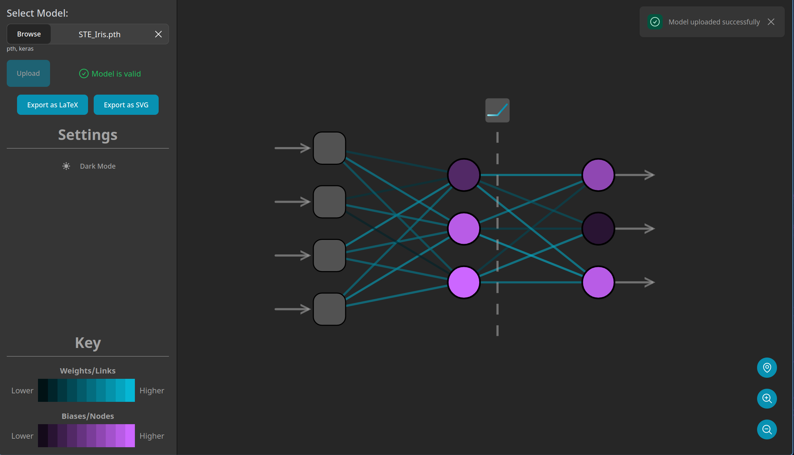

<!--
*** This readme is inspired by the Best-README-Template available at https://github.com/othneildrew/Best-README-Template. Thanks to othneildrew for the inspiration!
-->

<!-- PROJECT SHIELDS -->
<!--
*** I'm using markdown "reference style" links for readability.
*** Reference links are enclosed in brackets [ ] instead of parentheses ( ).
*** See the bottom of this document for the declaration of the reference variables
*** for contributors-url, forks-url, etc. This is an optional, concise syntax you may use.
*** https://www.markdownguide.org/basic-syntax/#reference-style-links
-->
[![Contributors][contributors-shield]][contributors-url]
[![Stargazers][stars-shield]][stars-url]
[![Issues][issues-shield]][issues-url]
[![MIT License][license-shield]][license-url]

<!-- [![Forks][forks-shield]][forks-url] -->

<!-- PROJECT LOGO -->
 

  

  <h1 align="center">NeuraViz</h3>

  

    NeuraViz is a web application for visualizing the underlying structure of artificial neural networks, primarily for teaching purposes.
     
    <a href="https://github.com/bennett-Wendorf/NeuraViz"><strong>Explore the docs »</strong></a>
     
     
    <a href="https://github.com/bennett-Wendorf/NeuraViz/issues">Report Bug</a>
    ·
    <a href="https://github.com/bennett-Wendorf/NeuraViz/issues">Request Feature</a>
  

<!-- TABLE OF CONTENTS -->

  
Table of Contents

  <ol>
    <li>
      <a href="#about-the-project">About The Project</a>
      <ul>
        <li><a href="#built-with">Built With</a></li>
      </ul>
    </li>
    <li><a href="#getting-started">Getting Started</a></li>
    <li><a href="#contributing">Contributing</a></li>
    <li><a href="#license">License</a></li>
    <li><a href="#contact">Contact</a></li>
    <li><a href="#acknowledgements">Acknowledgements</a></li>
  </ol>

<!-- ABOUT THE PROJECT -->
## About The Project

Neural networks are notoriously difficult to visualize for students and experienced engineers alike due to their scale and complexity. Too combat this problem, NeuraViz was devised to provide a simple, intuitive interface for visualizing the structure of neural networks. While it can be used on larger networks, such as those used for real-world problems, visualizing networks of that scale has diminishing returns. The structure of individual nodes and links at a scale of even hundreds of nodes just isn't meaningful. Instead, NeuraViz is intended to be used for smaller networks, such as those one might use to learn about how neural networks work. For example, the image above shows the visualization of a network trained to classify the Iris dataset, a famous toy example used primarily for teaching about neural networks.

### Built With

This project is written in Python with Quart and TypeScript with Svelte and FlowBite Svelte. In addition, the following libraries are used:
* [Python](https://www.python.org/)
* [Quart](https://pgjones.gitlab.io/quart/)
* [PyTorch](https://pytorch.org/)
* [scikit-learn](https://scikit-learn.org/stable/)
* [Pandas](https://pandas.pydata.org/)
* [Python-dotenv](https://pypi.org/project/python-dotenv/)
* [Typescript](https://www.typescriptlang.org/)
* [Svelte](https://svelte.dev/)
* [FlowBite Svelte](https://flowbite-svelte.com/)
* [Tailwind CSS](https://tailwindcss.com/)
* [D3.js](https://d3js.org/)
* [Popperjs](https://popper.js.org/)
* [Axios](https://axios-http.com/)
* [Svelte Heros V2](https://github.com/shinokada/svelte-heros-v2)
* For a full list of dependencies, see [package.json](https://github.com/Bennett-Wendorf/NeuraViz/blob/main/src/frontend/package.json) and [pyproject.toml](https://github.com/Bennett-Wendorf/NeuraViz/blob/main/src/backend/pyproject.toml)

Each of their respective licenses apply to their binaries and their use in this project. Their licenses can be found at the links above.

## Getting Started
To check out this project, simply navigate to the [website](https://neuraviz.bennettwendorf.dev/). You can upload your own model with PyTorch's `pth` format, or Keras' `keras` format, or check out the `testing/input_files` directory for some example models.

### Running locally
If you want to run this project for local development, you can clone the repository and install the dependencies. For the frontend, navigate to `src/frontend` and run `npm install && npm run autobuild`. Navigating to `src/backend` and running `pipenv install --dev` will install the backend dependencies. You can then run the backend with `pipenv run dev`. To run a production instance, compile the frontend with `npm run build` and run the backend with `pipenv run hypercorn api:app -b 0.0.0.0:8083`.

<!-- CONTRIBUTING -->
## Contributing

Contributions are what make the open source community such an amazing place to be learn, inspire, and create. Any contributions you make are **greatly appreciated**.

1. Fork the Project
2. Create your Feature Branch (`git checkout -b feature/AmazingFeature`)
3. Commit your Changes (`git commit -m 'Add some AmazingFeature'`)
4. Push to the Branch (`git push origin feature/AmazingFeature`)
5. Open a Pull Request

If you find an issue in existing code, feel free to use the above procedure to generate a change, or open an [issue](https://github.com/Bennett-Wendorf/NeuraViz/issues) for me to fix it.

<!-- LICENSE -->
## License

Distributed under the BSD 3-Clause License. See `LICENSE` for more information.

<!-- CONTACT -->
## Contact

Bennett Wendorf - [Website](https://bennettwendorf.dev/) - bennettwendorf@gmail.com

Project Link: [https://neuraviz.bennettwendorf.dev/](https://neuraviz.bennettwendorf.dev/)

<!-- ACKNOWLEDGEMENTS -->
## Acknowledgements
* [Img Shields](https://shields.io)

<!-- MARKDOWN LINKS & IMAGES -->
<!-- https://www.markdownguide.org/basic-syntax/#reference-style-links -->
[contributors-shield]: https://img.shields.io/github/contributors/bennett-Wendorf/NeuraViz.svg?style=flat&color=informational
[contributors-url]: https://github.com/bennett-Wendorf/NeuraViz/graphs/contributors
[forks-shield]: https://img.shields.io/github/forks/bennett-Wendorf/NeuraViz.svg?style=flat
[forks-url]: https://github.com/bennett-Wendorf/NeuraViz/network/members
[stars-shield]: https://img.shields.io/github/stars/bennett-Wendorf/NeuraViz.svg?style=flat&color=yellow
[stars-url]: https://github.com/bennett-Wendorf/NeuraViz/stargazers
[issues-shield]: https://img.shields.io/github/issues/bennett-Wendorf/NeuraViz.svg?style=flat&color=red
[issues-url]: https://github.com/bennett-Wendorf/NeuraViz/issues
[license-shield]: https://img.shields.io/github/license/bennett-Wendorf/NeuraViz.svg?style=flat
[license-url]: https://github.com/bennett-Wendorf/NeuraViz/blob/main/LICENSE
